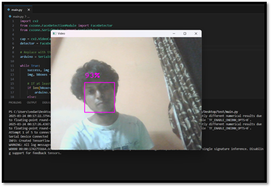
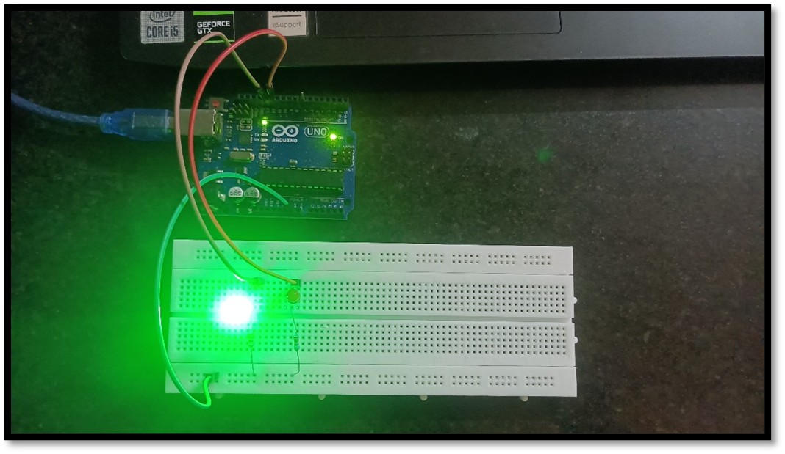
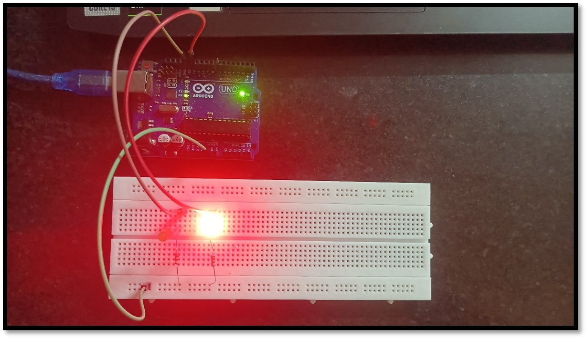
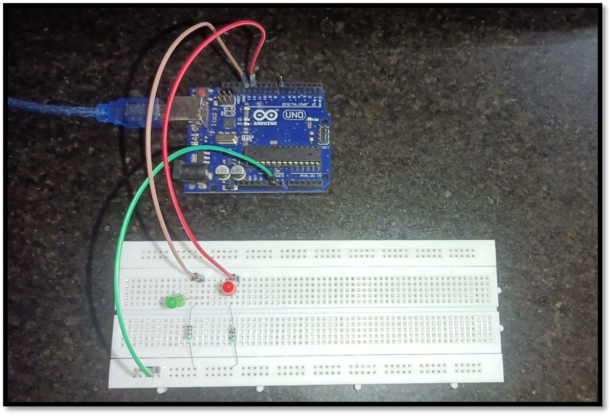

# Face Tracking using Arduino

## 🎯 Project Overview

A real-time face detection and tracking system built using **Python**, **OpenCV**, and **Arduino**.  
The system uses a webcam to detect human faces and communicates with an Arduino Uno via serial communication to control LEDs indicating detection status.

- When a face is detected → **Green LED turns ON**  
- When no face is detected → **Red LED turns ON**

This project demonstrates hardware-software integration using computer vision and embedded systems.

---

## 🎯 Project Objective

The goal of this project is to develop a simple and affordable face tracking system that integrates:

- Computer Vision  
- Serial Communication  
- Arduino Hardware Control  

The system captures video from a webcam, detects faces in real-time, and sends signals to the Arduino board to visually indicate the detection result using LEDs.

---

## ✨ Features

- Real-time face detection using OpenCV  
- Hardware control using Arduino Uno  
- Serial communication between Python and Arduino  
- LED indicators for detection feedback  
- Simple and low-cost electronic components  
- Easy-to-understand circuit design  
- Practical demonstration of AI + IoT integration  

---

## 🛠 Tech Stack

| Technology           | Purpose                          |
|---------------------|---------------------------------|
| **Python**           | Face detection and video processing |
| **OpenCV**           | Computer vision library          |
| **CVZone**           | Simplified face detection module |
| **Arduino C++**      | Hardware control                 |
| **Serial Communication** | Data transfer between Python and Arduino |

---

## 🔌 Hardware Components

| Component           | Quantity    |
|---------------------|-------------|
| Arduino Uno         | 1           |
| Breadboard          | 1           |
| LEDs (Red & Green)  | 2           |
| 220Ω Resistors      | 2           |
| Jumper Wires        | Several     |
| Laptop Webcam       | 1           |

---

## 📸 Project Demonstration

### 🔍 Face Scanning  
The webcam continuously scans the environment for human faces.  



### ✅ Face Detected  
When a face is detected:  
- Python sends signal `[1,0]`  
- Arduino activates Green LED  



### ❌ No Face Detected  
When no face is detected:  
- Python sends signal `[0,1]`  
- Arduino activates Red LED  



---

## ⚡ Circuit Diagram

The circuit consists of:

- LED connected to pin 13 (Green LED)  
- LED connected to pin 12 (Red LED)  
- Both LEDs connected through 220Ω resistors  

```
Arduino Pin 13 → Resistor → Green LED → GND  
Arduino Pin 12 → Resistor → Red LED → GND  
```



---

## 📂 Project Structure

```
FACETRACK/
│
├── arduino/
│   └── facetrack.ino
│
├── python/
│   └── main.py
│
├── screenshots/
│   ├── circuit.jpg
│   ├── face_detected.jpg
│   ├── no_face.jpg
│   └── scanning.png
│
└── README.md
```

---

## 🧠 System Architecture

```
Webcam
   ↓
Python (OpenCV + CVZone)
   ↓
Face Detection
   ↓
Serial Communication
   ↓
Arduino Uno
   ↓
LED Output (Face Detected / Not Detected)
```

---

## 💻 Python Code

The Python script captures webcam input and performs face detection.

```python
import cv2
from cvzone.FaceDetectionModule import FaceDetector
from cvzone.SerialModule import SerialObject

cap = cv2.VideoCapture(0)
detector = FaceDetector()

arduino = SerialObject('COM5')

while True:
    success, img = cap.read()
    img, bBoxes = detector.findFaces(img)

    if len(bBoxes) > 0:
        arduino.sendData([1,0])
    else:
        arduino.sendData([0,1])

    cv2.imshow("Video", img)

    if cv2.waitKey(1) & 0xFF == ord('q'):
        break
```

---

## 🔧 Arduino Code

The Arduino receives serial signals and controls LEDs accordingly.

```cpp
#include <cvzone.h>

SerialData serialData(2, 1);
int valsRec[2];

void setup() {
  pinMode(13, OUTPUT);
  pinMode(12, OUTPUT);
  serialData.begin();
}

void loop() {
  serialData.Get(valsRec);
  digitalWrite(13, valsRec[0]);
  digitalWrite(12, valsRec[1]);
  delay(10);
}
```

---

## ⚙️ How the Project Works

### 1️⃣ Webcam Capture  
Python captures live video feed using OpenCV.

### 2️⃣ Face Detection  
The CVZone FaceDetector identifies faces in each frame.

### 3️⃣ Serial Communication  
Python sends signals to Arduino:

| Signal  | Meaning       |
|---------|---------------|
| `[1,0]` | Face detected |
| `[0,1]` | No face detected |

### 4️⃣ LED Feedback  
Arduino activates LEDs to indicate detection status.

---

## 🧠 Skills Demonstrated

- Computer Vision with OpenCV  
- Python Hardware Integration  
- Arduino Programming  
- Circuit Design and Electronics  
- Serial Communication Protocols  
- Real-Time Image Processing  

---

## 🌍 Real World Applications

- 🔐 Smart surveillance systems  
- 🤖 Human-following robots  
- 🏠 Smart home automation  
- 🎮 Gesture-based interfaces  
- 🥽 AR/VR interaction systems  

---

## 🚀 Future Improvements

- Servo motor based camera tracking  
- Multiple face tracking  
- Face recognition system  
- Integration with Raspberry Pi  
- Smart security monitoring system  

---
